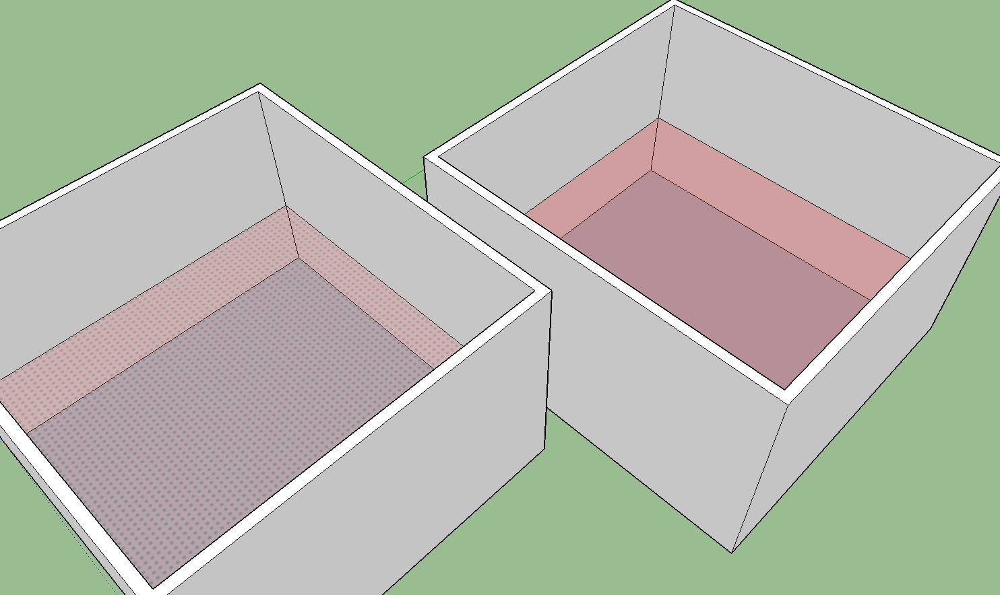
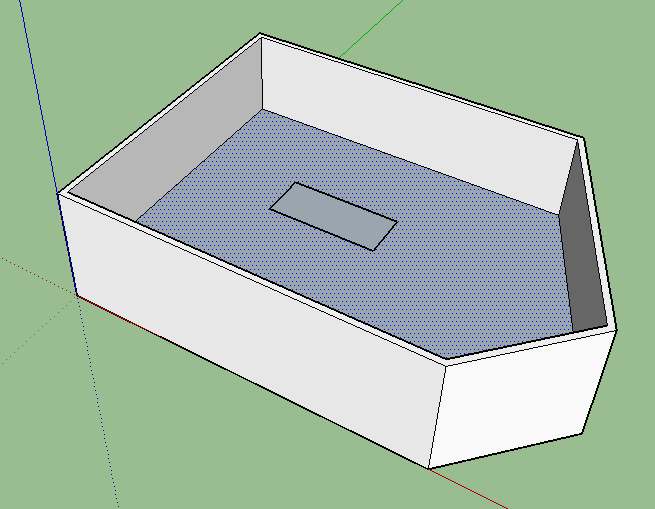
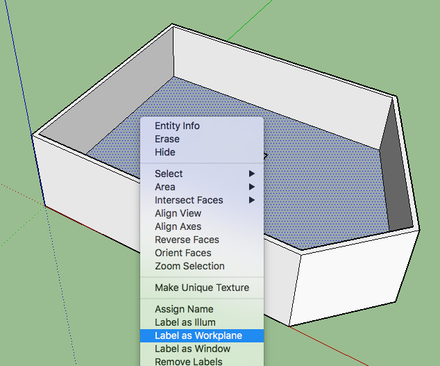
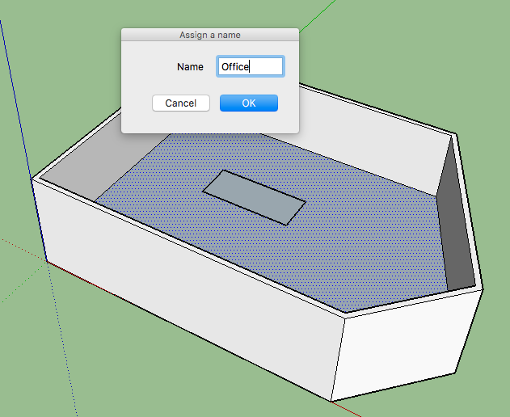
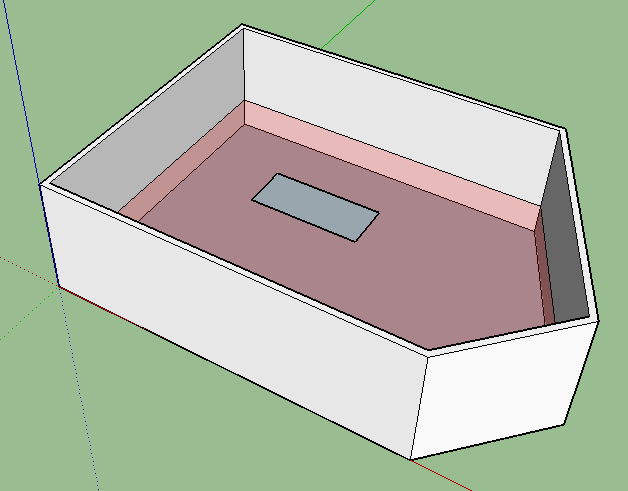

# Add a Workplane

Including workplanes into the model will be useful for obtaining numerical \(quantitative\) results such as Useful Daylight Illuminance, Daylight Autonomy, Daylight factor and other.

Workplanes will be shown as a semi-transparent red surface, although this surface is labeled as "Workplane", and will not be exported to the Radiance model as a surface but as a set of sensors where illuminance \(or other value\) will be calculated.

~~For now, Workplanes need to be horizontal surfaces.~~ Workplanes can have any shape and orientation. The can even be non-planar \(i.e. the curved surface of a cylinder\). In this regard, it is important to check the orientation of the workplane. The back side of it will be textured with dots, while the front side of it will be plain red. This difference may be seen in the image below.

## Including workplanes

### Step 1: Draw a surface that you want to use as a Workplane

It can be any shape and also have holes, as is shown in the image below. It can also be tilted.

### Step 2: Right click the surface.

When right clicking, look for "Label as workplane \(GH\)" in the Context menu, and click it.

### Step 3: Write the name of the workplace

The idea is to give it a reasonable name as “Office desk” or “hallway”. This name will be used when exporting sensors and visualizing results.

### Step 4: The workplane will be shown as a semi-transparent red surface

### Step 5: Check orientation

Workplanes are oriented surfaces, which makes it necessary to check that they are pointing where we really want. The back-side of a Workplane may be identified by the dots that are printed on it, while the front side is plain red. Make sure that the front-side is pointing where you want \(usually up\).

SketchUp allows flipping surfaces by right-click --&gt; reverse faces

### Step 6: Hide/Show workplanes

You may hide or show the workplanes by using the **Extensions/Groundhog/View/Show Workplanes** menu.

## Grouping several workplanes as if they were one

It is sometimes very useful to group several Workplanes as if they were one \(i.e. they behave like a single space\). For example, 1 workplane may be drawn on each of the 5 west-facing offices on a building, but their requirements are the same and the results we want are actually aggregated.

For grouping several workplanes we have to follow the exact same process shown above, with the exception that **more than one surface has to be selected** before "right click --&gt; Label as workplane".

## Final location of the sensors

When exporting a workplane, it will be subdivided in triangles \(pixels\). The size of these triangles may be chosen in the **Extensions/Groundhog/Preferences** menu, under the **Workplanes** tab.

It must be noted, though, that the selected area for each pixel is a reference, and not all pixels will be that size. This is caused by the triangulation algorithm used, which subdivides the workplane again and again until all pixels are equal or smaller than the selected value.

### Notes

_Very complex workplanes will result in very small sensor areas... This will generate errors when loading back the results \(The infamous 'Points are not planar'\). Avoiding very complex workplanes is recommended._

