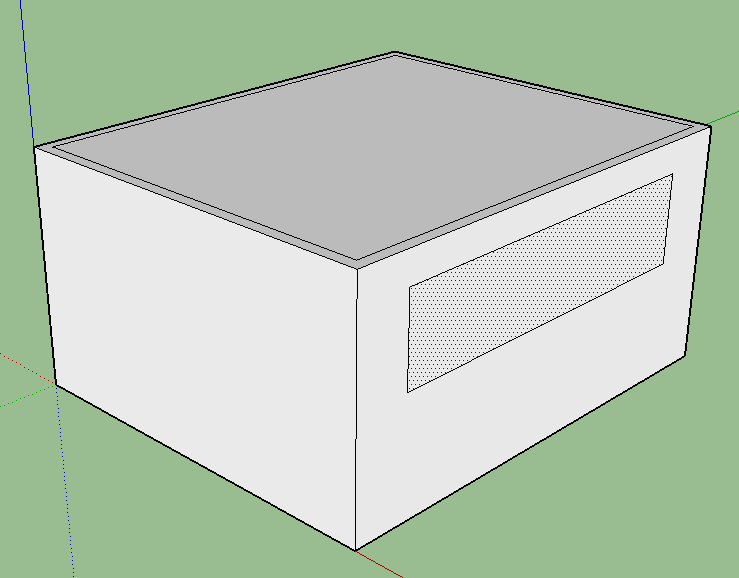
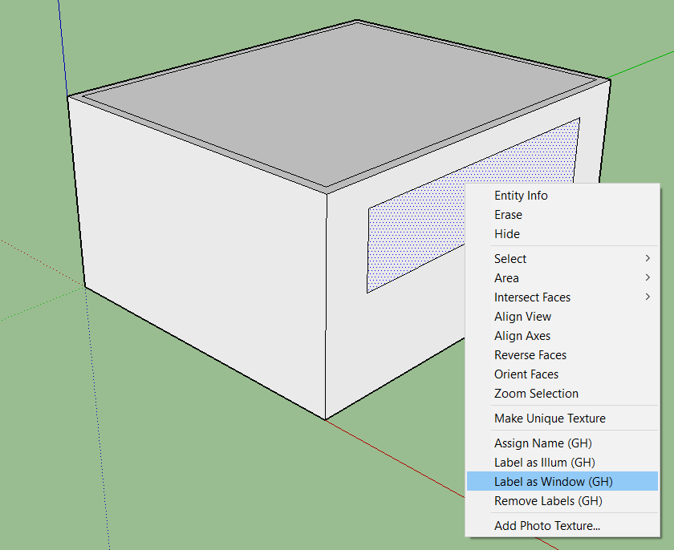
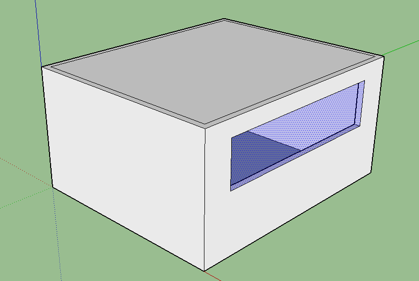

# Adding Windows

The whole idea here is to make a window that Groundhog actually identifies as such. This, as explained in the Getting Started section, will be important when exporting the model to Radiance.

## Step 1: Draw a surface that you want to label as a Window

## Step 2: Right click the surface.

When right clicking, look for "Label as Window" in the Context menu, and click it.

## Step 3: The window will be shown as a semi-transparent blue surface

## Notes

* Several faces can be labeled at once by selecting them together \*
* You should take care of the normal of the surface you transform if you intend to use the Three, Four or Five phase methods. \*

