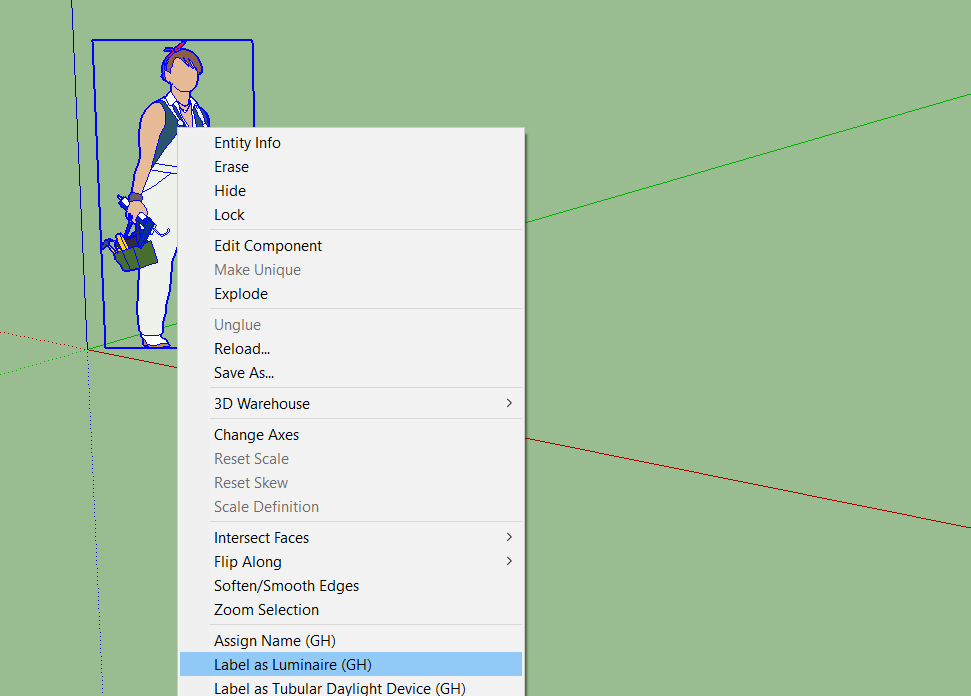
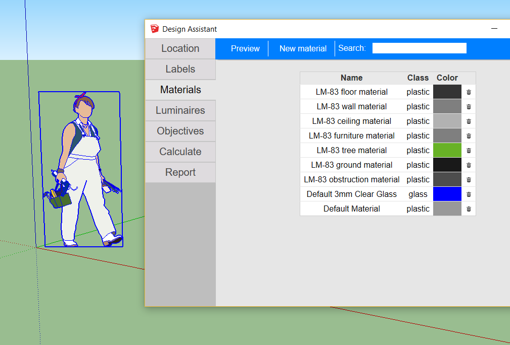
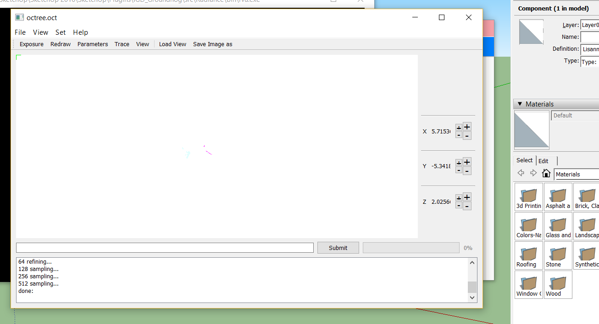

# Getting started

What you should know before even start using Groundhog.

## Groundhog's interface

Groundhog has a relatively small interface, with no toolbars. In fact, the only difference that can be noticed at first sight is the appearance of the **Groundhog** sub-menu under the **Extensions** menu. In this menu you will find actions that you will not do very often while modeling, like exporting to Radiance or changing preferences. For other more common tasks you can use the Design Assistant, which will be explained in detail later.

The preferred way of performing common actions while modeling is by means of the **Context menus** \(i.e. right-click on something\). Depending on what you right-clicked, Groundhog will select and offer several actions. All these actions may be identified by the _\(GH\)_ at the end.

## Checking that it works

If everything went well during the installation, you should be able to use the **Design Assistant** to Preview the model. The "Preview" button appears several times in the Design Assistant... one of them is located under the "Materials" tab.

After clicking the "Preview" button, if everything worked well, you should see a white screen appear.

## Understanding Groundhog

Groundhog is designed to use as much as possible the main SketchUp features. Even if this might sound obvious, this allows using other geometry-generating-plugins along with Groundhog without problems. You can even download models from the 3D Warehouse \(some complex models will include "non planar" faces... in my experience, I just erase them, and the model is usually not affected\).

Internally, Groundhog only analyzes SketchUp [Faces](http://www.sketchup.com/intl/en/developer/docs/ourdoc/face.php), [Groups](http://www.sketchup.com/intl/en/developer/docs/ourdoc/group#definition) and [Components](http://www.sketchup.com/intl/en/developer/docs/ourdoc/componentdefinition), and only exports Radiance polygons \(which will not only be triangles, but more complex polygons as well\). This means that a cylinder will be approximated as a bunch of rectangles or triangles, and the same happens with a sphere. The only exception to this are the circles. They will be actually exported as a circle, not as a polygon.

Groundhog always exports in the same distribution of files and folders, which differences between Windows, Workplanes, Illums and other kinds of surfaces. This is useful if you are using Groundhog as a tool for creating models. If you are going to use it as a tool on itself \(i.e. calculate everything within SketchUp\) you do not need to worry about this.

### Different kinds of surfaces: Labels

As was explained earlier, Groundhog will only export SketchUp's faces \(including those within components and groups\). Such faces may be of different classes, such as illum, window, workplane and "the rest".

Labeling is a key concept when using Groundhog. An important example of this is, for example, labeling a Workplane. In this case, you do not want it to be exported as a material surface made of plastic or metal; but as a set of sensors over which you will calculate illuminance. To make this difference, Groundhog uses **Labels**. The same happens with Windows... some calculations require differentiating Windows from other glazed components \(i.e. a glazed table\). Again, the way of making this difference is by checking at its label.

In order to be light, fast and easy to use, Groundhog differences between surfaces by "Labeling" them with a certain class. This has some advantages over some of the other options considered while designing Groundhog. For example, if a workplane has been defined within the model, dividing it \(by drawing a line within it\) or replicating it \(copying and pasting it\) will result in the existence of two workplane surfaces. In the same way, deleting it will make the workplane disappear without the need of going through complex internal data structures.

### Different kinds of objects: Labels again

Just as Surfaces, Groups and Components can be labeled as well. Labeling components and groups work in the exact same way as labeling surfaces, but instead of labeling a single surface you label a whole lot of them. Every time Groundhog imports results, for example, and show them as a whole bunch of colored triangles, it creates a Group and labels it as "Solved workplane". Now, when you export the model or perform calculations, you do not want the "Solved workplane" to be exported... even more, that workplane is an abstraction, and it does not really exist. You do not want it in your Renders.

