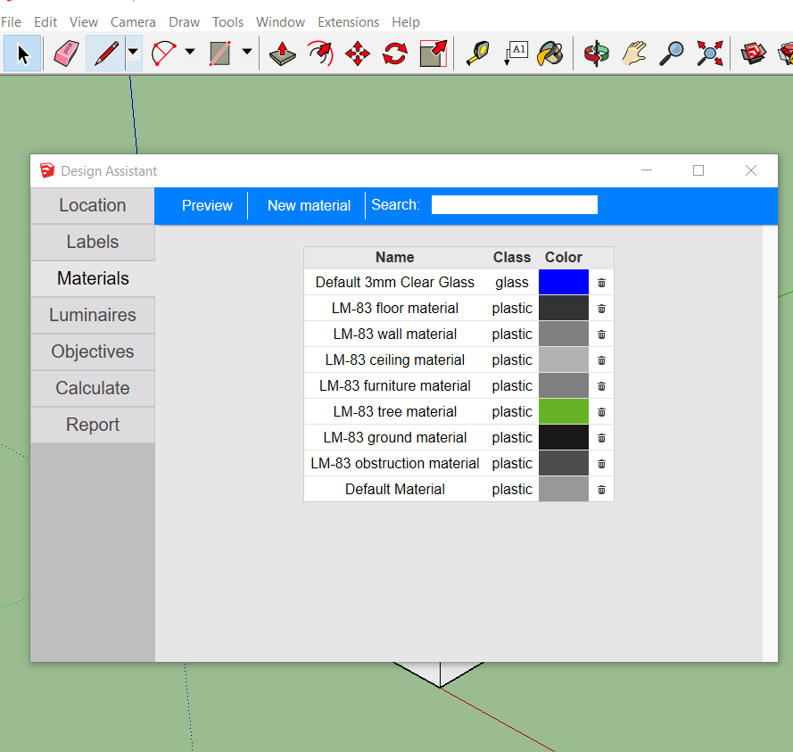
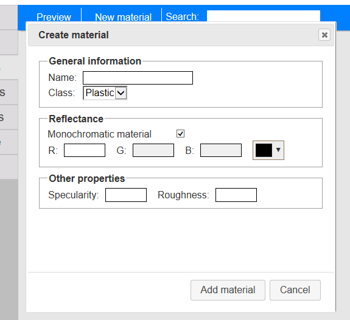

# Materials

Materials are a very delicate thing in lighting simulation. A model with incorrectly defined materials may return beautiful images and data to make nice plots, although it will all be incorrect \([GIGO rule](http://en.wikipedia.org/wiki/Garbage_in,_garbage_out)\). Accordingly, Groundhog allows defining Radiance materials using a Wizard, where you input the required values for your model to be physically correct. In such cases, Groundhog will export the faces with the materials you defined.

In case you just do not care about accuracy, you can just use SketchUp as usual, and let Groundhog figure out how the materials that your Radiance model must have in order to look like the SketchUp one. These materials, however, will always be perfectly diffusive \(lambertian\) plastics and glass. Also, it must be noted that, in order to generate the exact color you chose, the "guessed" materials may even be physically impossible to replicate.

## Using materials

Even though SketchUp has its own Materials panel, Groundhog adds another one, which only selects those that have physical information in them \(i.e. a Radiance definition\).

For using a material, just click on the name and the "Paint Tool" will be activated, with the corresponding material selected.

## Creating a Material

In the same Materials tab in the Design Assistant, you will see a "New Material" button. When clicking it, a dialog will appear which will ask you to fill the necessary information.

### Material colors

Groundhog has two different colors for every material. One of them is the one that will be exported to Radiance and has physically correct information; and the other is the color used by SketchUp to show the material. This distinction was made because many codes and documents only inform the "reflectance" of a material \(i.e. light concrete, pavement, white ceiling paint, etc.\) and not the R, G and B reflectances \(which lead to color\).

* If you are going to define a gray material, check the "monochromatic material" box and put the reflectance in the R value. **You can afterwards modify the representation color in the Color Picker**.
* If you want to work with color, make sure you input correct reflectances for each channel. Groundhog checks physical consistency, which is the reason why you may see the 

Groundhog provides the default materials defined in the IES LM-83-12. **These materials are all gray \(i.e. have the same R, G and B reflectance value\)**, even if some of them are shown in colors within SketchUp.

## How materials are exported

The process of exporting materials is the following \(done for each face\):

1. Groundhog checks if the surface has a front material. In case of not having one, it will use the back material. In case it does not have a back material either, default materials will be assigned \(a gray Lambertian material for opaque surfaces, and a clear glass for windows\).
2. After finding the SketchUp material, Groundhog will check if the material has physical optical information \(i.e. was input by the user as a Radiance material\).
3. If the SketchUp material has pysical optical information, it will be assigned to the surface in the Radiance model.
4. If the SketchUp material had not, then the material will be guessed.

Some important things may be concluded from above. First, **front-material has preference over back-material** on every surface. That is, if a surface has two materials, the front one will be used in the Radiance model. Second, **if the surface has no material, a perfectly diffuse gray material will be assigned**.

