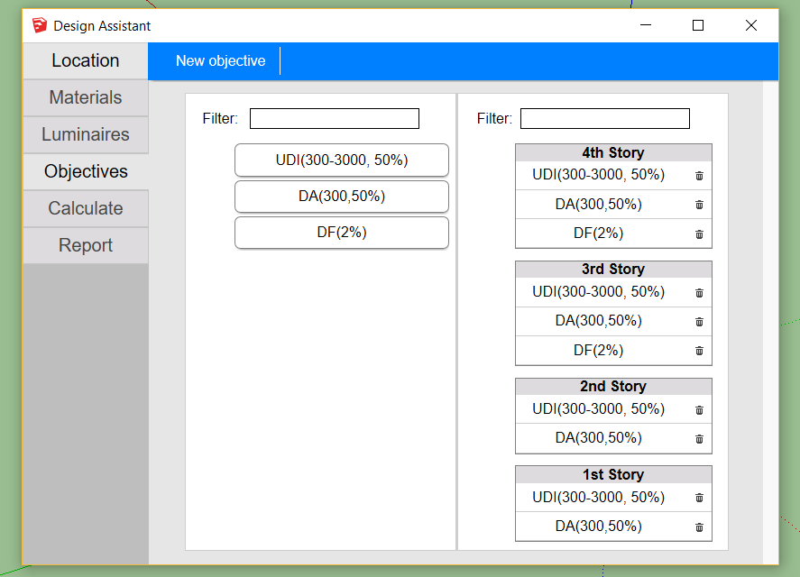

# Objectives

One of the things that may sound strange about Groundhog is that it forces you to use Objectives for performing calculations \(even though bypassing them is pretty easy\). The rationale behind this is that I do not think it is a good idea to just calculate a bunch of things for reference. On the contrary, I believe is really important to, before even designing a space, define what daylight metrics will be used and what values we want to achieve. In some cases, these objectives will be given by certifications or building codes \(i.e. LEED or the Chilean CES\). In many other cases, though, you will have to define your own objectives, which is still a good practice.

## The Objectives tab

The objectives tab is a relatively simple drag-and-drop interface, on which all the workplanes in the model appear in the right column, and all the objectives in the model appear in the left column.

You may create new objectives according to your needs. It is important to notice that not all the workplanes are required to have the same objectives.

