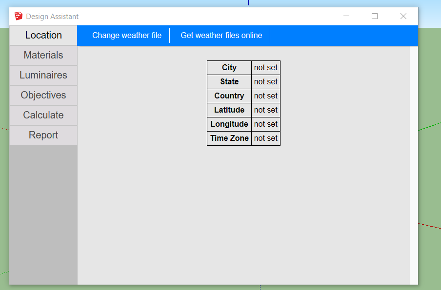

# The design assistant

The Design Assistant is Groundhog's core User Interface. From it, you will be able to do most of the stuff needed during the design and analysis process. The design assistant is opened directly from the Extensions / Groundhog menu.

The design assistant has a series of tabs located on its left. They are meant to help you in different parts of your project \(e.g. choosing location, calculating, creating and using materials, etc.\). These tabs are ordered from top to bottom following the process I often use for my projects. However, you may want to use a different order. These tabs are:

* **Location**: This Tab allows you inputing a EPW weather file to the model. When doing this, SketchUp's geo-location and time zone will be set up according to the weather file.
* **Materials**: The materials tab allow you creating, deleting and using new materials. Materials shown here all include physical data, so Radiance can model them correctly.
* **Luminaires**: This is an experimental feature that is waiting to be refined and tested. 
* **Objectives**: As explained in the "Objectives" chapter, Groundhog requires you to choose objectives for your workplanes. These are often defined by building codes and certifications \(LEED or Chilean CES\); however, when you are not using one of them, it is still a good practice to define objectives.
* **Calculate**: This tab allow you to define the simulation parameters for your calculations. This is part of the design assistant \(and not the Preferences UI\) as a reminder that these parameters should be adjusted for every model.
* **Report**: This tab was designed to provide simple and easy to read results.

In addition to the Tabs, the Design Assistant presents a blue Toolbar that changes according to the selected Tab.

## Notes:

Sometimes you may see that the Design Assistant has not been updated. If you see this happening, just close it and open it again. This often fixes the issue because, When loading the Design Assistant, Groundhog gathers information from the model. In some computers you can also "Right click" and "refresh".

